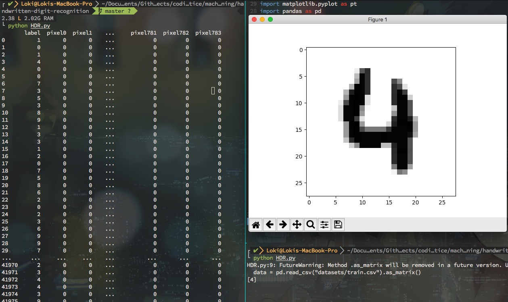

# Handwritten Digit Recognition with Decision Tree Exercise
In this exercise, I use decision tree to recognize pre-processed handwritten digit files, following this [tutorial](https://www.youtube.com/watch?v=aZsZrkIgan0) .

## Getting started
Follow the instructions below to use the program.

### Prerequisite
The following libraries are needed for this program:
- [Numpy](https://github.com/numpy/numpy): scientific computing with Python.
- [Matplotlib](https://github.com/matplotlib/matplotlib): 2D plotting library.
- [Pandas](https://github.com/pandas-dev/pandas): data analysis toolkit.
- [Scikit-learn](https://github.com/scikit-learn/scikit-learn): Python module for machine learning.

#### Dependencies for the libraries above
- [SciPy](https://github.com/scipy/scipy): open-source software for mathematics, science, and engineering.
- [Cython](https://github.com/cython/cython): a language that makes writing C extensions for Python as easy as Python itself.

### Installing
- Download the main program, HDR.py.
- Download the MNIST data (a collection of handwritten digit pre-processed data) [here](https://www.kaggle.com/c/digit-recognizer/data).

## Run the program
To use the program, execute the following command.
```
python HDR.py
```

### Screenshot:



