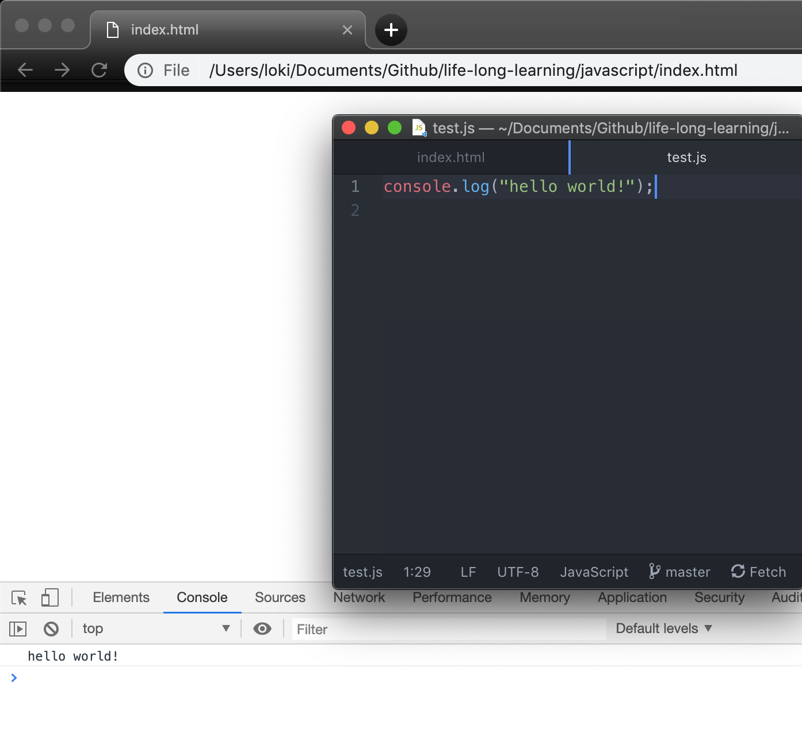
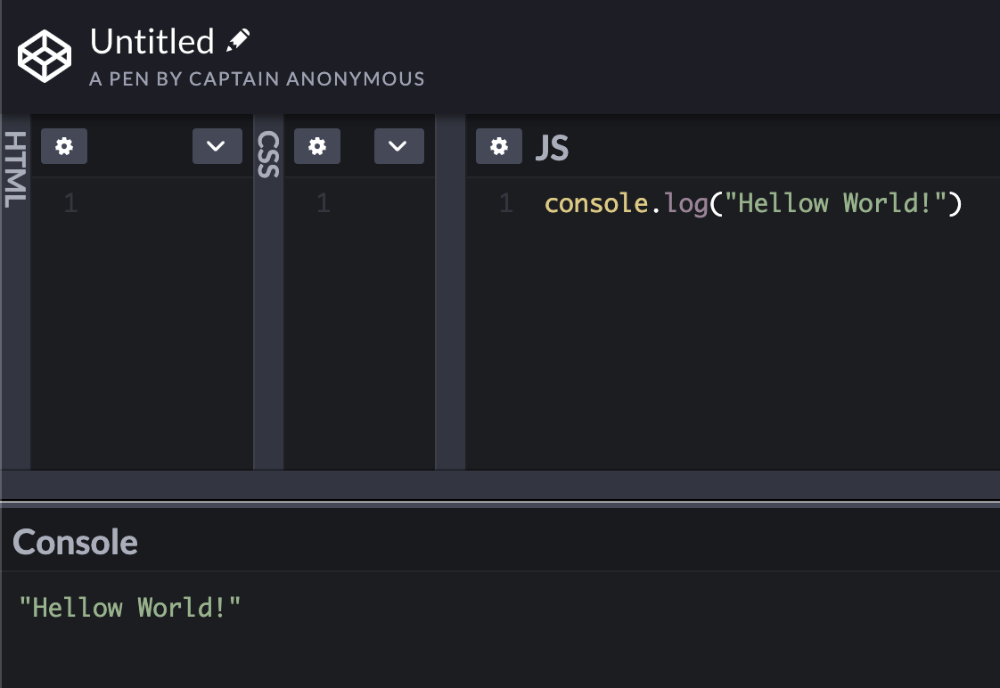
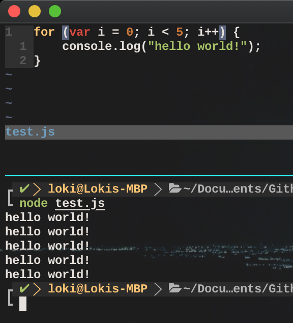

# Javascript
This notebook was written while following this [Youtube video](https://www.youtube.com/watch?v=PkZNo7MFNFg).

## What is JavaScript?
JavaScript is a programming language for the web. It is used to manipulate HTML and CSS, which are the two essential elements of a web page. Read more about Javascript [here](https://www.w3schools.com/whatis/whatis_js.asp).

## Installation
No installation is required. Most, if not all, modern search engines can run Javascript code.

## Environment
There are many development environment setups for JavaScript development. The most common and simplest approach would be using a HTML file and display it on your search engine.



There are online coding environment for JS development too, such as [JSFiddle](https://jsfiddle.net/) and [CodePen](https://codepen.io/pen/).



The easiest approach that I personally like the most would be using [Node.js](https://nodejs.org/en/) which allows you to run your JS code in your terminal.



## Basics
### Comment
```
// This is one way to do it

/*
This is another way to do it
*/
```

### Print (To Console)
Javascript's equivalent of print function is called console.log().
```
// This will print whatever string that is passed in on the console.
console.log("hello world");
```

### Variable Declaration
Javascript can determine a data type dynamically using the "var" keyword.
```
var myName = "Andy"
```

We can also declare variables with "let" and "const". Their types will also be determined at run time.

- var: create variables that are available in the nearest **function** scope where they are declared.
- let: create local variables that are only available in the **block** scope where they are declared.
- const: create variables whose values cannot be changed once declared. However, you can mutate data types such as array; changing the values in an array declared as const would be valid.

Read this excellent Stack Overflow answer on "var" v.s "let" [here](https://stackoverflow.com/questions/762011/whats-the-difference-between-using-let-and-var).

### Data Type
Javascript has data types such as undefined, null, boolean, string, symbol, number, object, etc.

#### Boolean
The boolean values in Javascript are lowercase.

#### String
We can declare strings using single or double quotation marks.
```
var s1 = 'this is valid';
var s2 = "this is also valid";
```

JS strings are immutable, which means the characters in a string cannot be changed once declared.
```
var s = 'something';
s[0] = 'a'  // this will cause an error
```

#### Array
Array behaves like Python list. It can contain data of different types.
```
var ourArray = ["the universe", 42];
var multiArray[["the world", 13], ["the earth", 32]];
```

#### :warning:Object
##### Declaration
One can declare a Javascript object like so.
```
var fruit = {
  1: 30,
  "name": "apple",
  "color": "red",
  "number": 5,
  "tags": ["healthy", "delicious"],
  "my description": "Eat one everyday, keep doctors away."
};
```
The strings on the left side of the colons are called properties (props for short), and the values on the right are our data.

##### Access Properties
To access properties of an object, we use dot notation. We can also use bracket notation as well. It is required if the property name is not of type string, or it has a space in it.
```
console.log(fruit[1]);    // prints 30
console.log(fruit.name);  // prints "apple"
console.log(fruit["my description"]);
```

##### Insertion & Deletion
We can add new properties to objects as well.
```
// insert new properties
fruit.recommended = true;
fruit[healthy] = true;

// delete properties
delete fruit[recommended];
delete fruit.healthy;
```

##### Others
```
// check if the object has the specified property
fruit.hasOwnProperty(recommended);
```

### Function
#### Declaration
To declare a function it can be as easy as...
```
function hello() {
  console.log("Hello!")
}
```

#### Default Parameter
Default parameters are pre-defined parameters with values. If they are not passed in as arguments, their default values are used.
```
function increment(num1, num2 = 1) {
  return num1 + num2;
}
increment(5);     // returns 6
increment(5, 2);  // returns 7
```

#### Rest Operator
Rest operator allows functions to have any number of parameters by converting inputs to an array. To use the operator, we simply place three dots in front of the parameter.
```
function add(...args) {
	var total = 0;
	for (var i = 0; i < args.length; i++) {
		total += args[i];
	}
	return total;
}
```

#### Spread Operator
Spread operator spreads out each individual element of an array. It looks exactly like the rest operator.
```
const arr1 = ['JAN', 'FEB', 'MAR', 'APR', 'MAY'];
let arr2;
(function() {
  arr2 = [...arr1];   // do a deep copy of arr1
})();
```

## Advanced
### Equality Operator & Strict Equality Operator
There are two types of equality operators, and they are == and ===. The former will attempt to convert both data to the same type before comparing their values, whereas the latter does not.
```
3 == 3    // true
3 == '3'  // true
3 === 3   // true
3 === '3' // false
```

The respective inequality operators are != and !==.

### Language Features
Variable inside of the function becomes global if it is declared without any keywords

```
function test() {
  temp = 5;
}
test();
console.log(temp);  // this will print out 5
```

---
typeof is a keyword for determining the type of a variable. It will return a string when called.
```
temp = 5;
console.log(typeof temp); // this will print out "number".
```

---
Object.freeze() can be used to prevent object to be changed.

---
Arrow function is a quick way to write anonymous functions.
```
var myConcat = function(arr1, arr2) {
  return arr1.concat(arr2);
}

// this is the same as
var myConcat = (arr1, arr2) => arr1.concat(arr2);
```

---
Destructuring assignment is a neat way to assign variables from objects.
```
var voxel = {x:13, y: 24, z: 35};

// this assigns the values of x, y to a, b respectively.
const {x:a, y:b} = voxel;
```

We can also do nested destructuring assigment.
```
const LOCAL_FORECAST = {
  today: {min: 72, max:83};
  tomorrow: {min: 73.3, max 84.6};
};

const {tomorrow: {max: maxOfTomorrow}} = LOCAL_FORECAST;
```
