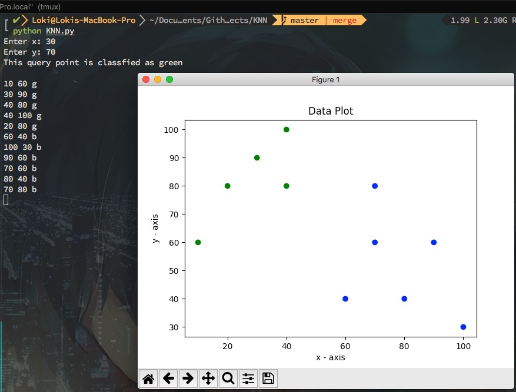

# K-Nearest Neighbors
A quick implementation of K-nearest neighbors algorithm.

## Getting started
Follow the instructions below to use the program.

### Prerequisite
[Matplotlib](https://github.com/matplotlib/matplotlib) is needed for this program.

### Installing
- Download the main program, KNN.py.
- Download sample-inputs file for some training data or make your own follow the same syntax.

## Run the program
To use the program, execute the following command.
```
python KNN.py
```
The program will then query for a set of x and y value. After the user has inputted a valid numbers (integers), the classifier will decide what color (category) the query point is.

## Notes
- The k hyper-parameter in K_nearest_neighbor function can be changed via input parameters.
- Entering a k larger than the number of input data will fail.
- The program only assumes 2 categories ('g' label for green color and 'b' for blue).

### Screenshot:

