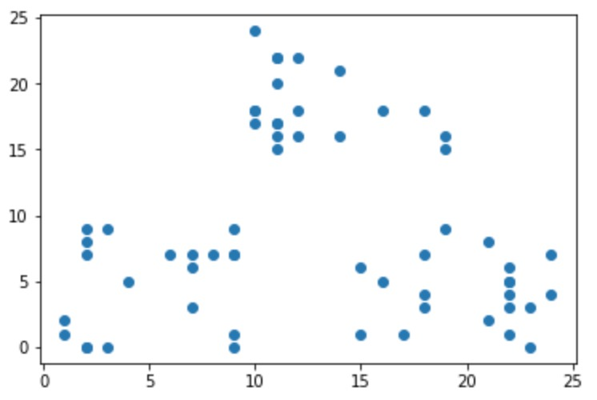
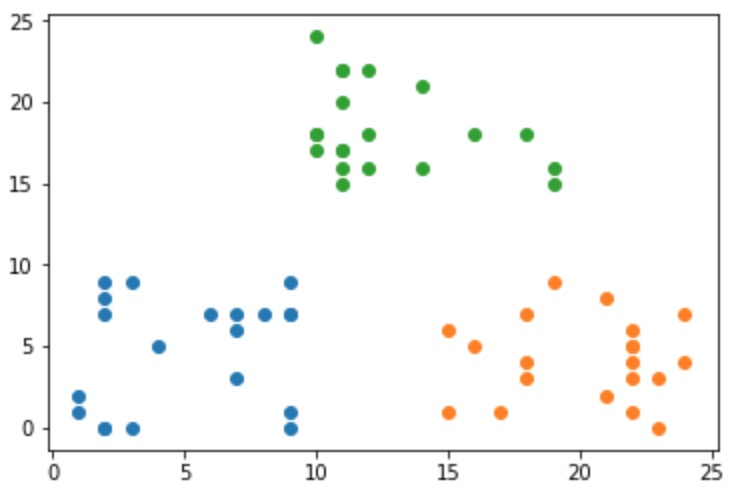

# Lloyd's Algorithm
In this exercise, I will go through the famous Lloyd's algorithm step by step and discuss its benefits and pitfalls. Working example and detailed explanation are included.

## Screenshots
Initial data:

After running the algorithm:

