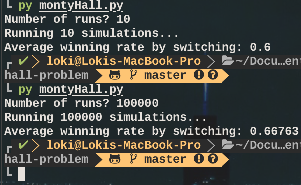

# Monty Hall Problem
A simple simulation of the famous Month Hall problem. This program simulates the average winning rate of switching the door after the host reveals a false door. See details [here](https://en.wikipedia.org/wiki/Monty_Hall_problem)

## Run the Program
1. Download montyHall.py file.
2. Enter `python montyHall.py` to start the program.

## Result
It might not seem obvious, but the probability of winning after switching is not 1/2. The correct probability is actually 2/3. See the wiki page via the link mentioned above for detailed explanation.

Our tests consistently match our expected result.

### Note
- The number of iterations can be changed to your liking.

### Screenshot

